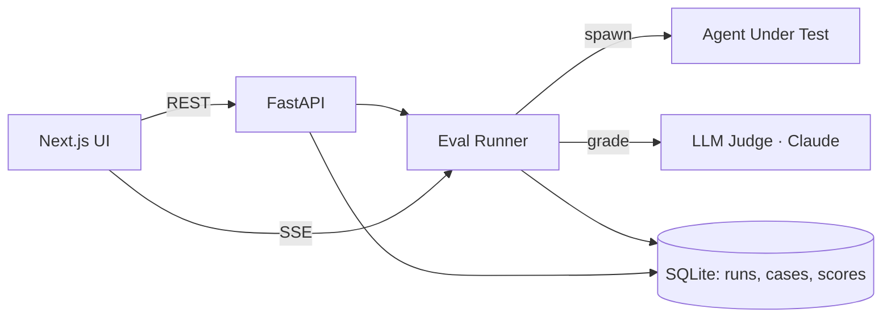

# RubricLab


> **Video walkthrough:** https://youtu.be/ZxXpCgOj6Ek
> **60-second overview:** https://youtu.be/yKHDELiphXc

> Open-source eval harness for LLM agents: define rubrics, run agents against test cases, score with LLM-as-judge, and diff runs in a web UI.

<!-- TODO: replace with a 5-10 second demo gif. Record with ScreenToGif on
     Windows or peek on macOS. Save to docs/demo.gif and update path here. -->


## What it is

RubricLab is a local-first evaluation harness for LLM agents. You give it a YAML rubric—graded criteria like `helpfulness: 1–5` or `pii_leaked: bool`—and a JSONL dataset of test cases, then point it at any agent: a Python callable or an HTTP endpoint returning `{output, trace}`. It runs each case through deterministic checks first (exact match, regex, JSON-schema, tool-call assertions), then calls Claude as a structured judge to score every rubric criterion and return its reasoning as JSON. Every run is stored in SQLite, tagged with the git SHA and agent version, and survives partial failures.

The web UI shows pass-rate badges across all runs, lets you drill into individual cases to inspect tool-call traces and judge verdicts, and diffs two runs side by side so regressions are visible in one click. Nothing leaves your machine.

## Quickstart

**Prerequisites:** Python 3.11+, Node 20+, `make`, an Anthropic API key. On Windows, run inside Git Bash or WSL2 (the Makefile uses `&` for background jobs).

```bash
git clone https://github.com/RitikPatill/rubriclab.git
cd rubriclab
cp .env.example .env
# Open .env and set ANTHROPIC_API_KEY=sk-ant-...
make install    # pip install -e ".[dev]" + npm install
make dev        # API → http://localhost:8000  ·  UI → http://localhost:3000
```

To seed two example runs and open the compare view immediately:

```bash
make demo
```

## Usage

Open `http://localhost:3000`. The runs dashboard lists every previous run with its pass-rate badge and git SHA.

Select the bundled `support-agent` suite and click **Run eval**. The 15 test cases stream in live; each one resolves to pass/fail with per-criterion scores as it completes. Click a failing case to open the trace viewer: the agent's tool calls, the judge's verdict, and its reasoning per criterion appear inline — for example, "agent escalated to human despite KB containing the answer — `helpfulness: 2/5`."

After changing the agent, trigger another run, then click **Compare runs**. Cases that flipped between pass and fail are highlighted with score deltas for each criterion. The in-UI rubric editor lets you tweak criteria and save without touching files; **Clone suite** creates a new suite against the same dataset so the original is preserved.

```bash
# The REST API is usable directly. Stream live progress for a run:
curl -N http://localhost:8000/runs/{run_id}/stream
```

## Architecture



See [docs/ARCHITECTURE.md](docs/ARCHITECTURE.md) for component breakdown and design decisions.

## Project structure

```
rubriclab/
├── apps/
│   ├── api/            FastAPI backend — runner, judge, adapters, SQLite persistence
│   └── web/            Next.js frontend — runs list, run detail, compare, rubric editor
├── examples/
│   └── support-agent/  Sample rubric (YAML), dataset (JSONL), and agent for the demo
├── docs/               Architecture docs, roadmap, and demo assets
├── scripts/            Demo seeding and recording helpers
├── Makefile            dev, test, lint, format, and demo targets
└── .env.example        Required environment variables
```

## Roadmap

- [ ] Replace `docs/screenshot.png` and `docs/demo.gif` with live captures from `make demo`.
- [ ] Configurable judge model per-suite — stored in the Suite row instead of a global env var.
- [ ] Hosted judge option — `JUDGE_ENDPOINT` for OpenAI-compatible or self-hosted models so the tool is not locked to Anthropic.
- [ ] Dataset import from production traces — a CLI that reads OpenTelemetry / LangSmith / Langfuse exports and converts them to JSONL test cases.
- [ ] Export endpoints — `GET /runs/{id}/export.csv` and `/export.json` for downstream notebook analysis.

## License

MIT — see [LICENSE](LICENSE).

---

Built autonomously by [autodev](https://github.com/RitikPatill/autodev),
a multi-agent orchestrator I designed. Each commit in this repo was
authored by me; the implementation work was performed by Sonnet under
the orchestrator's control. Read the orchestrator's README to see how.
