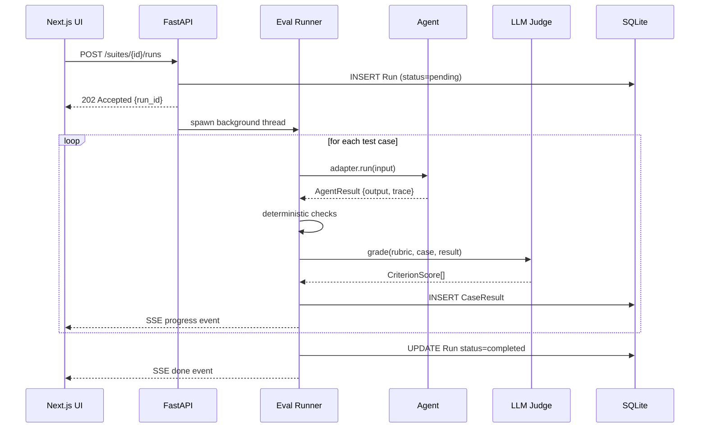

# Architecture

## Overview

RubricLab is a local-first evaluation harness with a FastAPI backend and a Next.js frontend. The backend orchestrates evaluation runs: it spawns agent calls via an adapter, runs deterministic checks, calls Claude-as-judge for rubric scoring, and persists every result to SQLite. The frontend streams live progress over SSE and provides run history, trace inspection, side-by-side comparison, and an in-browser rubric editor.

## Component map

| Component | Location | Responsibility |
|---|---|---|
| FastAPI app | `apps/api/src/api/main.py` | HTTP routing, CORS, lifespan |
| Eval runner | `apps/api/src/api/runner.py` | Orchestrates adapter → checks → judge → persist |
| LLM judge | `apps/api/src/api/judge.py` | Claude prompt construction, JSON parse, self-consistency aggregation |
| Deterministic checks | `apps/api/src/api/checks.py` | `exact_match`, `regex`, `json_schema`, `tool_call` |
| Agent adapters | `apps/api/src/api/adapters/` | `InProcessAdapter`, `HttpAdapter` |
| Rubric schema | `apps/api/src/api/schemas/rubric.py` | `load_rubric(path)` → `Rubric` |
| Dataset schema | `apps/api/src/api/schemas/dataset.py` | `load_dataset(path)` → `list[TestCase]` |
| ORM models | `apps/api/src/api/models.py` | `Suite`, `Run`, `CaseResult` |
| Next.js UI | `apps/web/src/` | App Router pages + shadcn/ui components |

## Data flow

## Design decisions

**1. SQLite over Postgres**
Local-first, zero-infra. Every run is a file you can copy, diff, or delete. Runs are immutable rows; partial results survive crashes because `CaseResult` rows are committed case-by-case.

**2. Background thread over async task queue**
Avoids Celery/Redis dependency. FastAPI `BackgroundTasks` runs the eval in a thread while SSE streams results back. Sufficient for offline, single-user use.

**3. SSE over WebSocket**
One-directional server push (progress events) fits SSE perfectly — no bidirectional channel is needed. Simpler to implement and debug.

**4. Claude-as-judge with structured JSON output**
Rubric criteria are passed as a typed JSON schema in the system prompt; Claude returns `{"criterion_id": {"score": ..., "reasoning": "..."}}`. Self-consistency mode samples N times and aggregates (median for scale criteria, majority vote for bool criteria) to reduce variance.

**5. Deterministic checks run first**
They are cheap and fail fast before spending tokens on the LLM judge.

**6. AgentAdapter protocol**
Duck-typed protocol (not ABC) so any callable that returns `AgentResult | str` works as-is with `InProcessAdapter`. No inheritance required.
